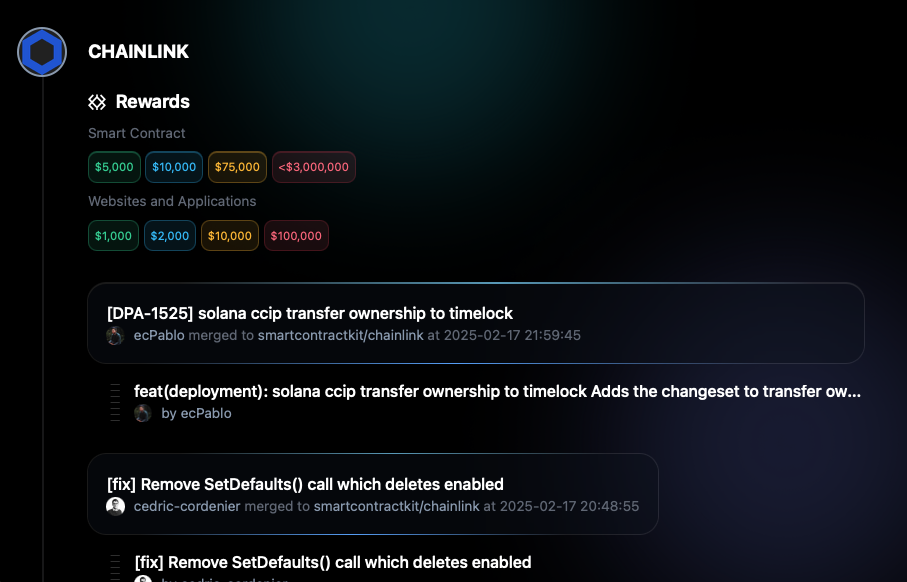

# What is DAF

Every day a Web3 protocol pushes to GitHub a patch to a vulnerability or a new feature. *DAF* is a daily activity feed of bug fixes and code changes in GitHub repositories listed as assets in scope for bug bounty programs in Immunefi.

Website: [https://infosec-us-team.github.io/daf/frontend-daf/src/](https://infosec-us-team.github.io/daf/frontend-daf/src/)

> At the time of writing, there are **427 GitHub repositories** with a bug bounty program in Immunefi.



# How to use it

Visit the [website](https://infosec-us-team.github.io/daf/frontend-daf/src/) once a day to see what's new and discover security patches by searching for the words "fix" and "bug" in the title of pull requests and commit messages.

# Features

Every day a static website is created listing every bug bounty program that updated their (GitHub) code in the past 24 hours, with details like:

- Protocol name, avatar, and a link to the GitHub account
- The rewards ($) for every severity on the bug bounty program and a link to it
- Pull requests, including their title, date, and a link to the PR
- Every commit, including its title and a link to it
- The Developer of every commit, including its name, avatar, and a link to his GitHub user

# Table of Contents

- [Overall Architecture](#overall-architecture)
- [UI Design Goal](#ui-design-goal)
- [Run locally](#run-locally)
- [Using a cron job to run periodically](#using-a-cron-job-to-run-periodically)
- [Maintenance](#maintenance)

# Overall Architecture

DAF has a **backend** and a **frontend**.

## Backend

The **backend** automates gathering GitHub repositories listed in Immunefi, extracting bounty information, scanning pull requests, and commits, and generating a static website (the frontend).

### Step 1. Data Collection
- **`build.sh`**  
  - It runs once a day.
  - Fetches all **protocols** listed on **Immunefi**.
  - Extracts **GitHub repositories** linked to these protocols.
  - Retrieves **bounty reward details** and **logos**.
  - Aggregates data into a JSON file (`all_protocols.json`).
  - Starts the Processing Layer

### Step 2. Processing Layer
- **`scan-prs.py`**  
  - Scans all **pull requests** and **commits** from the collected repositories.
  - Aggregates data into a JSON file (`all_prs.json`).
  
- **`create-static-site.py`**  
  - Generates a **static website** displaying pull requests, commits, and bug bounty reward info.

## Frontend

A static site using Tailwind CSS.

# UI Design Goal

The static site should be viewed as a **tool**. Every element displayed to the user must contribute to the tool's objective.

Consequently, there won't be a prominent header welcoming visitors to the site or a navigation bar filled with links to external sites like social networks.

The very first thing users see should be precisely what they want to see.

# Run locally

### Requirements

- [ibb](https://github.com/infosec-us-team/ibb/) - A CLI tool to find anything from Immunefi REST API with as few keystrokes as possible (by `infosec_us_team`)
- [jq](https://github.com/jqlang/jq) - JSON processor for command-line data manipulation
- Python 3.x environment

Clone the repository:

```bash
git clone https://github.com/infosec-us-team/daf.git
cd daf
```

To avoid hitting GitHub's API rate limit use a [personal access token](https://github.com/settings/personal-access-tokens).

Create a `.env` file outside of the project folder (yes, outside... don't trust your ".gitignore" skills, better safe than sorry).
> Your file structure should look like this:
```
.env
daf/
 ├─backend-daf/
 ├─frontend-daf/
 ├─readme-resources/
 └─README.md
```
Add your personal access token to the `.env` file:
```
GITHUB_TOKEN=your_token_here
```

Build the site by running the `build.sh` script inside `./backend-daf/`:
```bash
# First, cd into `./backend-daf/`
cd ./backend-daf/
# Now, build!
./build.sh
```
> This step is going to take up to 20 min. depending on the total amount of protocols with GitHub repos in Immunefi.

Finally, you should have a static site at `./frontend-daf/src/index.html`

We like to run an http server so we can access the site with all devices in the local network.

```
# cd out of backend-daf and into frontend-daf
cd ../frontend-daf/src/
# run the http server
python3 -m http.server 8000
```

# Using a cron job to run periodically

Open crontab:
```bash
crontab -e
```

Add a job:
```bash
0 1 * * * /path/to/build.sh
```

This runs the tool daily at 1am.

# Maintenance

There is no guarantee that the code in this repository will be maintained if Immunefi or GitHub change their APIs, nor that the static site at GitHub-Pages (`https://infosec-us-team.github.io/daf/frontend-daf/src/`) will continue to be updated daily.

We recommend cloning the code and running the tool on your own server.
